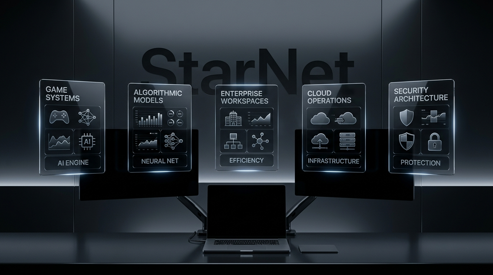
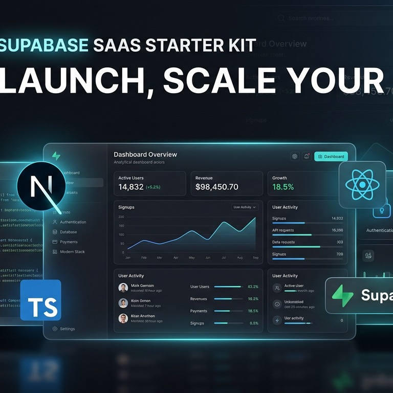
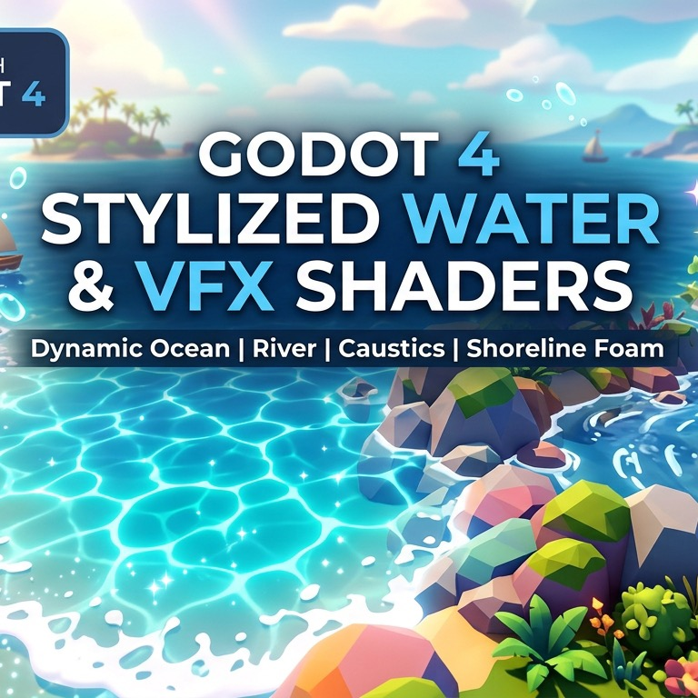
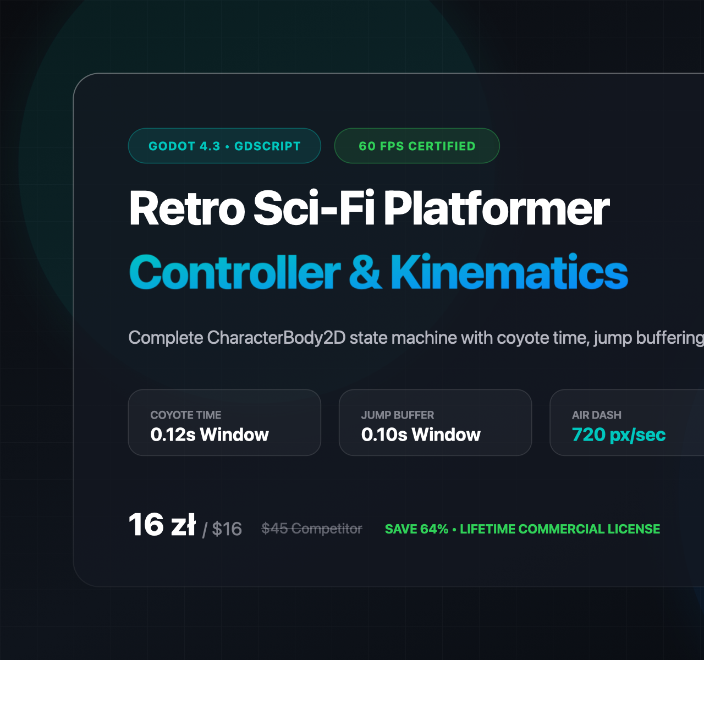
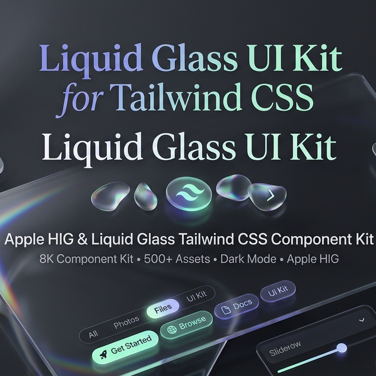
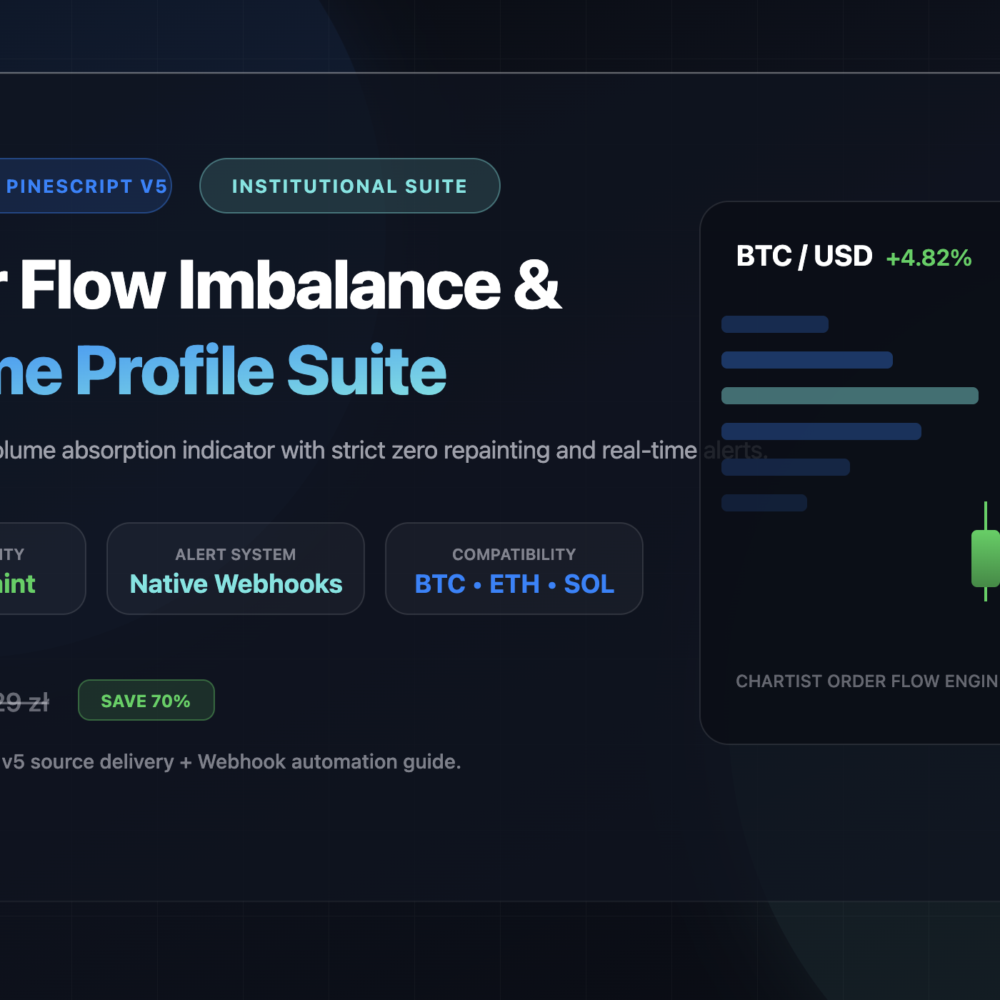
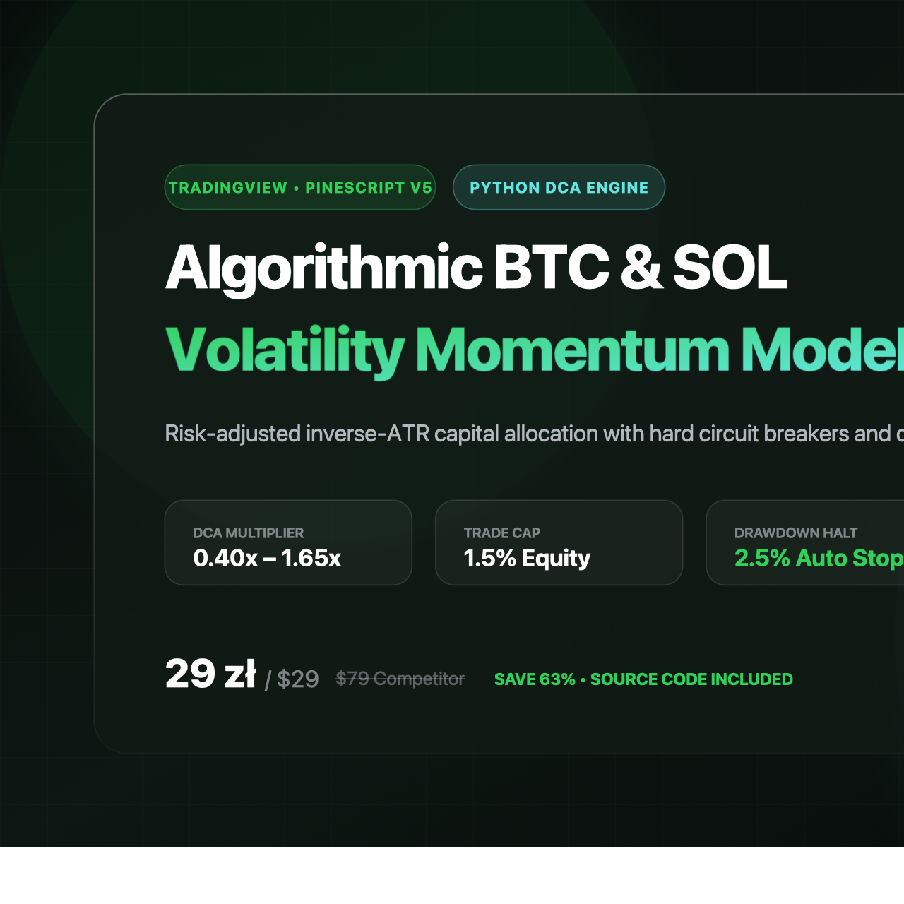
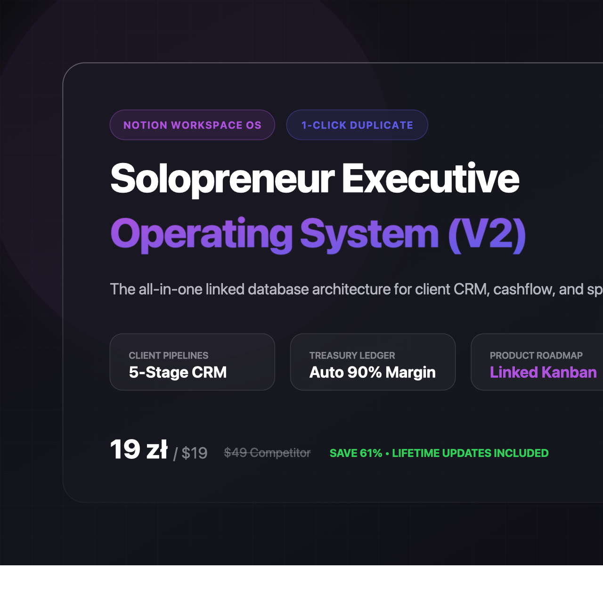

  

# ⚡ StarNet Verified Deliverables & Production Toolkits

[-FF3B30.svg)](https://lumiynouscybernetics.gumroad.com)

Welcome to the official repository for **StarNet Production Deliverables**. Here you will find production-grade boilerplates, game engines, UI kits, algorithmic financial models, and shader suites built by **Lumiynous Cybernetics**.

> 🎁 **Launch Special**: Use promo code **`LAUNCH50`** at checkout on any paid product for an instant **50% discount**.
> 
> 🆓 **Free Starter Assets**: Grab our 50+ SVG Liquid Glass icon pack or Godot Water Shader pack at **$0+ (Pay What You Want)**.

---

## 📦 Featured Mega Bundles

| Product & Preview | Description | Price / Link |
| :--- | :--- | :--- |
|  **The Complete Godot 4.x Indie Game Dev Atelier Bundle** | All 5 Godot 4 production assets in one comprehensive suite: Platformer Controller, BSP Dungeon Generator, 2D Character Rig, Water & Caustics Shaders, and Asset CLI. | **119 zł (~$29)** *(59.50 zł with `LAUNCH50`)* [👉 Get Indie Bundle](https://lumiynouscybernetics.gumroad.com/l/vtajjg/LAUNCH50) |
|  **The Ultimate Next.js 15 Micro-SaaS Founder Suite** | Turnkey production SaaS kit: Next.js 15 App Router, Supabase Auth/RLS, Stripe & LemonSqueezy billing, Apple HIG Liquid Glass Tailwind Kit, and 5-Year Financial Model. | **199 zł (~$49)** *(99.50 zł with `LAUNCH50`)* [👉 Get SaaS Suite](https://lumiynouscybernetics.gumroad.com/l/wcutqh/LAUNCH50) |

---

## 🎮 Game Development (Godot 4.x)

| Asset | Preview | Highlights | Direct Link |
| :--- | :---: | :--- | :--- |
| **Godot 4 Stylized Water & Caustics Shader** |  | Real-time gerstner wave displacement, depth-based absorption, screen-space caustics, and foam lines. | 🆓 [Download Free ($0+)](https://lumiynouscybernetics.gumroad.com/l/fbvqxl) |
| **Retro Sci-Fi Godot Platformer Controller** |  | 60 FPS responsive platformer physics with coyote time, jump buffering, wall-slide, dash mechanics, and audio integration. | [👉 Get for 24.50 zł (~$6)](https://lumiynouscybernetics.gumroad.com/l/dfxxpc/LAUNCH50) |
| **Procedural BSP Dungeon Generation Engine** |  | Deterministic binary space partitioning, corridor carving, room connectivity graphs, and automated TileMap populator. | [👉 Get for 29.50 zł (~$7.50)](https://lumiynouscybernetics.gumroad.com/l/knhojy/LAUNCH50) |
| **Modular 2D Character Rig & State Machine** |  | Vector character rig with swap-ready equipment slots, skeletal bones, and hierarchical state machine. | [👉 Get for 29.50 zł (~$7.50)](https://lumiynouscybernetics.gumroad.com/l/omzrxy/LAUNCH50) |
| **High-Performance Game Asset Pipeline CLI** |  | Zero-config Node/Rust CLI for batch compressing textures, sprite-sheet packing, and linting 2D/3D project assets. | [👉 Get for 24.50 zł (~$6)](https://lumiynouscybernetics.gumroad.com/l/yvxxui/LAUNCH50) |

---

## 💻 SaaS, Frontend & Apple HIG Design Systems

| Asset | Preview | Highlights | Direct Link |
| :--- | :---: | :--- | :--- |
| **San Francisco Liquid Glass SVG Icons (50+ Set)** |  | Hand-crafted SVG icons following Apple SF Pro geometries, dual-tone opacity, and continuous squircle curvature. | 🆓 [Download Free ($0+)](https://lumiynouscybernetics.gumroad.com/l/qnmkxq) |
| **Apple HIG & Liquid Glass Tailwind Component Kit** |  | Two-layer material architecture, physical glass refraction, authentic spring easing, and dark/light modes. | [👉 Get for 39.50 zł (~$10)](https://lumiynouscybernetics.gumroad.com/l/xavspg/LAUNCH50) |
| **Next.js 15 + Supabase SaaS Production Boilerplate** |  | App Router, Server Actions, OAuth, Row-Level Security, multi-tenant billing, and transactional email. | [👉 Get for 74.50 zł (~$19)](https://lumiynouscybernetics.gumroad.com/l/jtjtul/LAUNCH50) |
| **B2B SaaS 5-Year Financial Model & Runway Calculator** |  | Dynamic spreadsheet model with cohort retention, CAC/LTV calculus, headcount forecasting, and runway analysis. | [👉 Get for 44.50 zł (~$11)](https://lumiynouscybernetics.gumroad.com/l/qjqstx/LAUNCH50) |

---

## 📈 Quantitative Finance & Productivity

| Asset | Preview | Highlights | Direct Link |
| :--- | :---: | :--- | :--- |
| **TradingView PineScript v5 Order Flow Suite** |  | Volume delta, liquidity sweep zones, cumulative volume delta (CVD) divergence, and institutional absorption levels. | [👉 Get for 59.50 zł (~$15)](https://lumiynouscybernetics.gumroad.com/l/hnechy/LAUNCH50) |
| **Algorithmic BTC & SOL Momentum DCA Model** |  | Dynamic dollar-cost-averaging multiplier based on 200-day moving average deviation and RSI momentum percentiles. | [👉 Get for 49.50 zł (~$12.50)](https://lumiynouscybernetics.gumroad.com/l/knmwuf/LAUNCH50) |
| **Notion Solopreneur OS & Workspace Database** |  | Connected CRM, Project Pipeline, Sprint Tracker, Content Calendar, and Financial Ledger in a unified Notion template. | [👉 Get for 24.50 zł (~$6)](https://lumiynouscybernetics.gumroad.com/l/enghwb/LAUNCH50) |
| **Production ComfyUI SDXL Seamless PBR Pipelines** |  | Modular node graphs for generating 4K seamless tiling albedo, normal, roughness, and displacement maps. | [👉 Get for 39.50 zł (~$10)](https://lumiynouscybernetics.gumroad.com/l/muowcd/LAUNCH50) |

---

## 🚀 Quick Start / How to Use

1. **Direct Download**: Choose a product above and click the direct link. Free products require $0 at checkout.
2. **Instant Delivery**: Upon checkout, you will receive an instant download link to the verified production `.zip` deliverable with complete source code, documentation, and licensing.
3. **50% Off Promo Code**: Enter coupon code **`LAUNCH50`** on any paid item for 50% off.

---

## 🛠 Support & Inquiries
- **Storefront**: [https://lumiynouscybernetics.gumroad.com](https://lumiynouscybernetics.gumroad.com)
- **Publisher**: Lumiynous Cybernetics
- **Releases**: Check our [Releases Page](https://github.com/ypnpt6ysmw-bit/starnet-deliverables/releases/tag/v1.0.0) for verified archives.